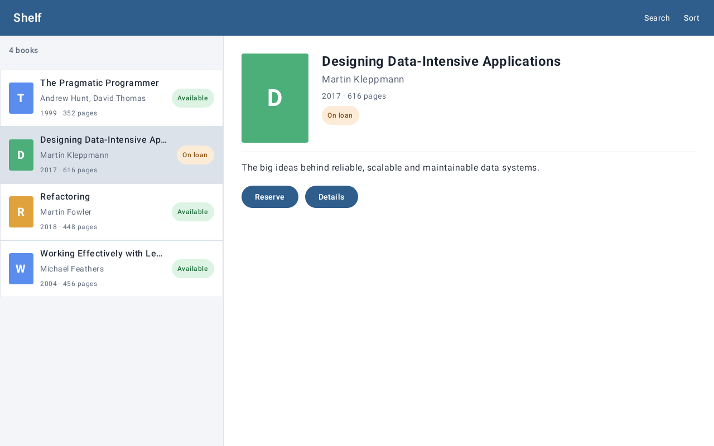
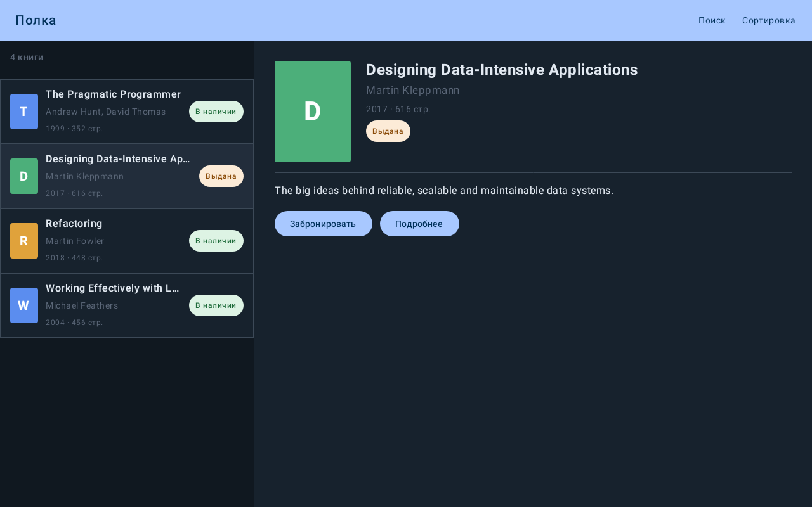

# Android UI Renderer MCP

[Русская версия](README.ru.md)

Local MCP for agents developing Android interfaces with XML/View or Jetpack Compose. It renders a
layout, target screen, or top-level composable into a screenshot and an inspectable UI tree.

The Android project does not receive a permanent Robolectric dependency or test source.

## Demo projects

Two equivalent open Android projects demonstrate the renderer on the same Material 3 "Shelf" book
library. They are real applications, but every render receives its data explicitly rather than
running production navigation or data loading.

| | XML / View | Jetpack Compose |
| --- | --- | --- |
| Project | [`sample/`](sample/README.md) | [`sample-compose/`](sample-compose/README.md) |
| Render tool | `render_layout`, `render_target` | `render_compose` |
| UI entry point | layout, fragment, or activity target | top-level `@Composable` FQCN |
| Data | `fixture`, `recyclerViews`, overlays | named JSON arguments |
| Run every example | `python3 sample/render.py` | `python3 sample-compose/render.py` |

Both projects include the same seven scenarios:

| Scenario | XML / View | Jetpack Compose |
| --- | --- | --- |
| Selected book row | `item_book` | `ComposeBookItem` |
| Long title, `fontScale: 1.3` | layout fixture | `ComposeBookItem` arguments |
| Book list | fragment + `RecyclerView` | `ComposeBookList` |
| Master-detail | fragment + `<include>` | `ComposeLibrary` |
| Complete screen | activity + toolbar + fragment | `ComposeShelfScreen` |
| Loading state | overlay layout | `ComposeShelfScreen(loading = true)` |
| Russian dark state | resource qualifiers | `ComposeShelfScreen(language = "ru", dark = true)` |

Each runner stores a screenshot, tree, normalized request, and replay recipe in its own `renders/`
directory. Compose requests use a fully qualified composable function name plus named JSON arguments;
the project-level Compose theme is discovered and applied by the renderer.

### Whole screen

| XML / View | Jetpack Compose |
| --- | --- |
|  |  |

### Russian dark state

| XML / View | Jetpack Compose |
| --- | --- |
|  |  |

## What a render produces

A render is not only a picture. Every run leaves four files, and both demo projects commit them for
each scenario in their `renders/<scenario>/` directory. The XML/View example below is shown for
[`02-item-book-long-title-font-1.3`](sample/renders/02-item-book-long-title-font-1.3).

**1. `request.json` and `replay.json` — the input, for history and replay.** `request.json` is the
normalized request the worker executed. `replay.json` is the recipe to repeat it: the MCP tool, its
arguments and the project module, variant and test task.

```json
{
  "format": "android-ui-renderer-mcp/replay/v1",
  "tool": "render_layout",
  "arguments": {
    "layout": "item_book",
    "widthDp": 400,
    "densityDpi": 320,
    "fontScale": 1.3,
    "fixture": {
      "@id/title": { "text": "Designing Data-Intensive Applications: The Big Ideas Behind Reliable, Scalable, and Maintainable Systems" },
      "@id/statusBadge": { "text": "On loan", "backgroundDrawable": "@drawable/bg_badge_on_loan", "textColor": "#8A4B08" }
    }
  },
  "project": { "root": "sample", "module": ":app", "variant": "debug", "testTask": ":app:testDebugUnitTest" }
}
```

(Shortened. A real `replay.json` records the absolute project root; in the committed demo files it is
rewritten to `sample`.)

**2. `render.png` — the render itself.** Drawn from the same laid-out View hierarchy as the tree below.


**3. `view-tree.json` — the component tree.** Every View with its class, ID, state, text, padding,
margins and absolute bounds in pixels; TextViews also carry `textLayout`. Here it shows what the picture
only hints at: the title keeps its bounds, but 81 characters are replaced by the ellipsis.

```json
{
  "id": "title",
  "className": "android.widget.TextView",
  "text": "Designing Data-Intensive Applications: The Big Ideas Behind Reliable, Scalable, and Maintainable Systems",
  "textLayout": { "textSizePx": 40.0, "maxLines": 1, "lineCount": 1, "ellipsisCount": 81, "truncated": true },
  "bounds": { "left": 144, "top": 72, "right": 614, "bottom": 126 },
  "margins": { "left": 24, "top": 0, "right": 16, "bottom": 0 }
}
```

The same tree is available right after a render through `get_view_tree(renderId)` and
`inspect_view(renderId, viewId)`, without reading files.

## Geometry feedback loop

`render_layout` inflates, applies the fixture, measures, lays out, serializes the View tree, and
draws the PNG from the same View hierarchy. Its result contains `renderId`, `screenshotPath`,
`viewTree`, and `viewTreePath`.

Use the follow-up tools for exact checks without another render:

```text
render_layout
  → inspect_view(renderId, "scan_button")
  → inspect_view(renderId, "viewfinder")
  → compare their bounds in pixels
```

`get_view_tree(renderId)` returns the complete hierarchy. `inspect_view(renderId, viewId)` returns
one node by Android ID. Nodes include resource name, class, text, state, padding, margins and
absolute bounds in pixels relative to the rendered root.

TextViews also carry `textLayout`: `textSizePx` (after density and font scaling), `maxLines`,
`lineCount`, `ellipsisCount` and `truncated`. A `maxLines="1"` title that ellipsizes keeps its bounds
and looks plausible in the PNG, so check `truncated` instead of relying on bounds alone:

```json
"textLayout": { "textSizePx": 31.0, "maxLines": 1, "lineCount": 1, "ellipsisCount": 27, "truncated": true }
```

Font scaling follows Android 14 (API 34) non-linear curves: at `fontScale: 1.3` a 12sp text grows
1.3×, while 24sp grows only 1.1×. Compare `textSizePx` across configs rather than assuming a linear factor.

Every render also returns timing metadata:

```json
{
  "timings": {
    "fingerprintMs": 35,
    "gradleMs": 840,
    "renderMs": 410,
    "totalMs": 1065
  }
}
```

`gradleMs` is the wall time of the temporary Gradle/Robolectric test task. `renderMs` is the
inflate-to-PNG/View-tree portion inside that probe; it is included in `gradleMs` and `totalMs`.

## Reproduce a render

Every sidecar run directory contains the rendered `render.png`, `view-tree.json`, and two
reproducibility artifacts:

- `request.json` — the normalized `RenderRequest` used by the worker;
- `replay.json` — the MCP tool name, its arguments, and the project module, variant, and test task.

`render_layout` and `render_target` responses expose these locations as `requestPath` and
`replayPath`. To repeat a render, call the `tool` from `replay.json` with its `arguments` against
the same project revision and renderer version. The manifest may include absolute local-image paths
when such fixture images were explicitly supplied.

## Production inflation context

The sidecar inflates from a themed Android `Activity`, not the application context. Before the
Activity lifecycle and inflation it applies the requested resource configuration:

- `theme`: an app style name or `@style/name`; omitted means the application manifest theme;
- `nightMode`: selects night or not-night resources;
- `fontScale`: `0.5` through `3.0`;
- `locale`: a BCP 47 tag such as `ru-RU`;
- `orientation`: `portrait` or `landscape`, including layout/resource qualifiers.

For example:

```json
{
  "layout": "screen_scanner",
  "theme": "@style/AppTheme",
  "nightMode": true,
  "fontScale": 1.3,
  "locale": "ru-RU",
  "orientation": "landscape"
}
```

## Connect from Cursor

Build the MCP once:

```bash
git clone https://github.com/hram/android-ui-renderer-mcp.git
cd android-ui-renderer-mcp
./gradlew installDist
```

In the Android repository create `.cursor/mcp.json`:

```json
{
  "mcpServers": {
    "android-ui-renderer": {
      "type": "stdio",
      "command": "/absolute/path/to/android-ui-renderer-mcp/build/install/android-ui-renderer-mcp/bin/android-ui-renderer-mcp",
      "args": ["--stdio"],
      "env": {
        "PROJECT_PATH": "${workspaceFolder}"
      }
    }
  }
}
```

Replace the path with your checkout location, restart Cursor, then check **Customize → MCPs**.
Cursor documents project MCP configuration in its [MCP guide](https://prod.cursor.com/docs/mcp).

## Render a layout

The agent supplies real or test values explicitly. MCP does not guess values from `tools:*` XML
attributes and does not invent business data.

```json
{
  "layout": "item_cart_product",
  "widthPx": 722,
  "densityDpi": 212,
  "background": "#FFFFFF",
  "fixture": {
    "@id/productName": { "text": "Пуф Руби" },
    "@id/productArticle": { "text": "Арт. 80064525" },
    "@id/productCheckbox": { "checked": true },
    "@id/quantityText": { "text": "1" },
    "@id/amountFinalText": { "text": "1 599 ₽", "visibility": "visible" },
    "@id/mandatory": { "text": "Есть обязательные товары", "visibility": "visible" }
  }
}
```

Fixture keys are View IDs. The available overrides are text, hint, content description,
visibility, enabled/selected/checked state, text and background colors, a background drawable,
text size, strike-through, and an image from an absolute local path, an app drawable resource, or a solid color. Local images
must be regular files no larger than 20 MiB; use `@drawable/name` (or `name`) for an app drawable.

## Render a Jetpack Compose function

`render_compose` renders a top-level `@Composable` directly. Pass the fully qualified function
name and named visual arguments. The renderer reads the Kotlin signature, generates a typed Kotlin
call in its temporary probe, creates omitted callback arguments as no-ops, and draws the resulting
`ComposeView`. The project is not modified.

```json
{
  "function": "com.hoff.appstore.screens.reports.ReportItem",
  "arguments": {
    "role": "ADMIN",
    "model": {
      "applicationId": "ru.hoff.tablet.dev",
      "versionCode": 123456789,
      "versionName": "1.1.1",
      "message": "Automatic report",
      "url": "",
      "businessUnitId": "730",
      "personnelNumber": "7101754",
      "dateTime": "2025-02-13 10:34",
      "fileName": "report.txt",
      "issueUrl": null,
      "comment": "",
      "imageUrl": null,
      "isActive": true,
      "checked": true
    }
  },
  "widthPx": 1280,
  "heightPx": 800,
  "densityDpi": 240
}
```

Arguments map to Kotlin parameter names. Primitives, nullable values, enums, data classes,
mutable properties on data-class instances, and `List`/`Set` collections are generated as typed
Kotlin values. Compose output uses its accessibility semantics as the returned component tree.

## Render RecyclerView rows

`recyclerViews` supplies deterministic, local adapter data. The renderer inflates the real
`itemLayout` for each row and applies that row's fixture to views inside the row. It does not run
fragment code, DI, or network calls. A `LinearLayoutManager` is installed automatically.

```json
{
  "layout": "fragment_catalog_groups_split",
  "widthDp": 1280,
  "heightDp": 800,
  "recyclerViews": {
    "@id/groupsRecyclerView": {
      "itemLayout": "item_catalog_group",
      "items": [
        {
          "@id/numberBadge": { "text": "31" },
          "@id/name": { "text": "Bedrooms" },
          "@id/nomenclatureGroupsBadge": { "text": "12 NG" },
          "@id/root": {
            "selected": true,
            "backgroundDrawable": "@drawable/bg_catalog_group_row_selected"
          }
        }
      ]
    },
    "@id/subgroupsRecyclerView": {
      "itemLayout": "item_catalog_subgroup",
      "items": [
        { "@id/number": { "text": "301" }, "@id/name": { "text": "Beds" } }
      ]
    }
  }
}
```

Use `orientation: "horizontal"` for horizontal lists; the default is vertical. `recyclerViews`
accepts at most 20 lists, 200 rows per list, and 500 rows in total.

## Render overlays and loading indicators

Use `overlays` to layer XML layouts above either a direct layout render or an activity-fragment
target. Each overlay has its own fixture scope. Indeterminate `ProgressBar` and
`CircularProgressIndicator` controls are rendered as a deterministic static ring in PNG output.

```json
{
  "overlays": [{
    "layout": "view_blocking_progress_overlay",
    "fixture": {
      "@id/blocking_progress_overlay_root": { "visibility": "visible" },
      "@id/blocking_progress_message": { "visibility": "visible", "text": "Please wait…" }
    }
  }]
}
```

## Render an activity host with a fragment

Use `render_target` when a fragment must be rendered inside the XML shell of its activity. The
renderer inflates the activity layout, inserts the fragment layout into `containerId`, then applies
the supplied fixtures and RecyclerView rows. It deliberately does not instantiate production
Fragment classes or execute DI, navigation, and network calls.

```json
{
  "target": {
    "kind": "activity_fragment",
    "activityLayout": "activity_main",
    "containerId": "fragmentContainer",
    "fragmentLayout": "fragment_catalog_groups_split"
  },
  "widthPx": 1280,
  "heightPx": 728,
  "densityDpi": 240,
  "orientation": "landscape"
}
```

## Reproduce the target device

Use `widthPx`/`heightPx` when Layout Inspector gives physical bounds, together with
`densityDpi`. For logical bounds use `widthDp`/`heightDp` instead; do not pass both units for one
dimension.

For the inspected tablet card:

```json
{
  "layout": "item_cart_product",
  "widthPx": 722,
  "densityDpi": 212
}
```

## Android variants

MCP uses `:app` and `debug` by default. For a project with product flavors, pass the variant in
the MCP environment, for example `ANDROID_UI_RENDERER_VARIANT=uiDebug`. No file needs to be added
to the Android project; MCP creates its temporary probe under `.android-ui-renderer/`.

The probe is a JUnit 4 test. For the render run only, MCP adds Robolectric and — when neither
`testImplementation` nor the variant's test configuration declares `junit:junit` — JUnit 4.13.2. A
JUnit version the project already declares is left as is.

The probe test is intentionally executed for every render so that a fresh PNG and View tree are
always produced. Gradle still reuses unchanged compilation and resource outputs. Check `timings`
on the target project before deciding whether a persistent renderer worker is necessary.
