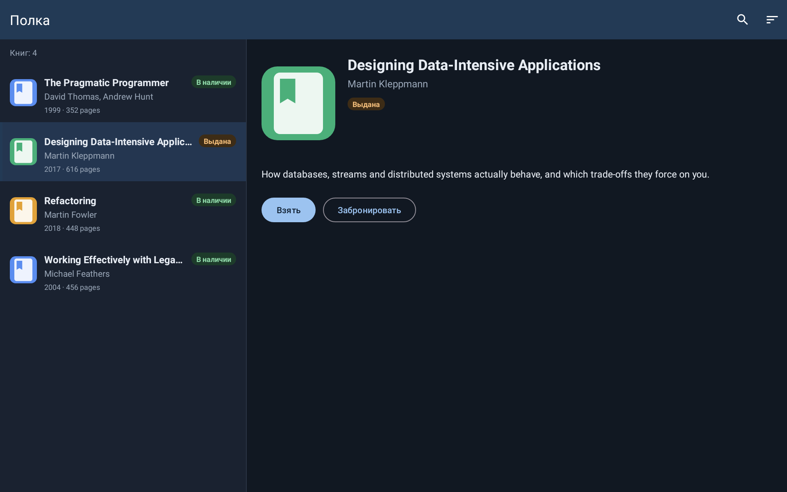
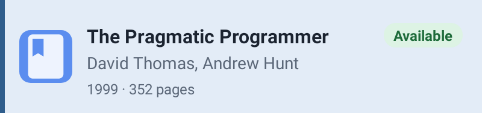

# Android UI Renderer MCP

[English version](README.md)

Локальный MCP-сервер для AI-агентов, разрабатывающих Android-интерфейсы на XML. Агент передаёт layout, тестовые данные и размеры целевого устройства, а сервер возвращает PNG-скриншот и дерево View.

Проект Android не получает постоянную зависимость Robolectric и дополнительные тестовые исходники.

## Демо-приложение

[`sample/`](sample/README.md) — небольшое открытое Android-приложение (XML/View, Material 3, «Shelf» —
библиотека книг), сделанное, чтобы показать все возможности renderer на проекте, который может
склонировать кто угодно. Это настоящее приложение с Activity, фрагментами и адаптером над локальными
данными, но renderer этот код не выполняет: каждый запрос рендера передаёт данные явно.

| Экран | Layout | Что проверяет |
| --- | --- | --- |
| Строка списка | `item_book` | ConstraintLayout, обложка из drawable, заголовок с `maxLines="1"`, бейдж статуса, selected-фон |
| Фрагмент со списком | `fragment_book_list` | `RecyclerView`, заполненный строками из `recyclerViews` |
| Master-detail | `fragment_library` | список слева, детали через `<include>` справа, одна выбранная строка |
| Экран целиком | `activity_main` + фрагмент | `MaterialToolbar` с заголовком и меню из XML, фрагмент вставлен в `FragmentContainerView` |
| Состояние загрузки | `view_loading_overlay` | overlay поверх всего экрана, indeterminate-спиннер заморожен |

Семь готовых запросов лежат в [`sample/render-requests/`](sample/render-requests);
`python3 sample/render.py` прогоняет их через этот MCP-сервер и складывает результаты в
[`sample/renders/`](sample/renders).

## Compose-демо

[`sample-compose/`](sample-compose/README.md) — параллельная Jetpack Compose-версия того же
приложения Shelf. В ней повторены те же семь сценариев: строка книги, длинный заголовок при
увеличенном шрифте, список, master-detail, экран с тулбаром, загрузка и русская тёмная тема.
Это прямые вызовы `render_compose`: запрос передаёт FQCN composable-функции и именованные JSON-аргументы.
После `./gradlew installDist` все сценарии запускаются командой `python3 sample-compose/render.py`,
а результаты пишутся в [`sample-compose/renders/`](sample-compose/renders).

Экран целиком — тулбар Activity и master-detail фрагмент (`render_target`):


Тот же экран с loading overlay и с `locale: ru-RU` и `nightMode: true`:

| Loading overlay | Русская локаль, ночная тема |
| --- | --- |
|  |  |

Фрагмент с RecyclerView на экране размера телефона и одна строка списка:

| `fragment_book_list` | `item_book`, выбрана | `item_book`, `fontScale: 1.3` |
| --- | --- | --- |
|  |  |  |

## Что даёт один рендер

Рендер — это не только картинка. Каждый прогон оставляет четыре файла, и для каждого сценария демо
они закоммичены в `sample/renders/<сценарий>/`. Ниже они показаны для
[`02-item-book-long-title-font-1.3`](sample/renders/02-item-book-long-title-font-1.3).

**1. `request.json` и `replay.json` — входные аргументы, для истории и воспроизведения.**
`request.json` — нормализованный запрос, который выполнил worker. `replay.json` — рецепт повтора:
MCP-инструмент, его аргументы, модуль, вариант и тестовая задача проекта.

```json
{
  "format": "android-ui-renderer-mcp/replay/v1",
  "tool": "render_layout",
  "arguments": {
    "layout": "item_book",
    "widthDp": 400,
    "densityDpi": 320,
    "fontScale": 1.3,
    "fixture": {
      "@id/title": { "text": "Designing Data-Intensive Applications: The Big Ideas Behind Reliable, Scalable, and Maintainable Systems" },
      "@id/statusBadge": { "text": "On loan", "backgroundDrawable": "@drawable/bg_badge_on_loan", "textColor": "#8A4B08" }
    }
  },
  "project": { "root": "sample", "module": ":app", "variant": "debug", "testTask": ":app:testDebugUnitTest" }
}
```

(Сокращено. Настоящий `replay.json` хранит абсолютный путь к проекту; в закоммиченных файлах демо он
заменён на `sample`.)

**2. `render.png` — сам рендер.** Нарисован с той же разложенной иерархии View, что и дерево ниже.


**3. `view-tree.json` — дерево компонентов.** Каждая View с классом, ID, состоянием, текстом,
padding, margins и абсолютными bounds в пикселях; у TextView есть ещё `textLayout`. Здесь дерево
показывает то, на что картинка только намекает: границы заголовка не изменились, но 81 символ заменён
многоточием.

```json
{
  "id": "title",
  "className": "android.widget.TextView",
  "text": "Designing Data-Intensive Applications: The Big Ideas Behind Reliable, Scalable, and Maintainable Systems",
  "textLayout": { "textSizePx": 40.0, "maxLines": 1, "lineCount": 1, "ellipsisCount": 81, "truncated": true },
  "bounds": { "left": 144, "top": 72, "right": 614, "bottom": 126 },
  "margins": { "left": 24, "top": 0, "right": 16, "bottom": 0 }
}
```

То же дерево доступно сразу после рендера через `get_view_tree(renderId)` и
`inspect_view(renderId, viewId)`, без чтения файлов.

## Цикл геометрической проверки

`render_layout` выполняет inflate, применяет fixture, измеряет и раскладывает View, сериализует
дерево и рисует PNG с одного и того же экземпляра View hierarchy. В ответе есть `renderId`,
`screenshotPath`, `viewTree` и `viewTreePath`.

Для точной проверки без повторного render используйте следующие инструменты:

```text
render_layout
  → inspect_view(renderId, "scan_button")
  → inspect_view(renderId, "viewfinder")
  → сравнить их границы в пикселях
```

`get_view_tree(renderId)` возвращает полное дерево. `inspect_view(renderId, viewId)` возвращает
один View по Android ID. Узел содержит resource name, класс, текст, состояние, padding, margins и
абсолютные границы в пикселях относительно корня рендера.

У TextView есть блок `textLayout`: `textSizePx` (после применения density и font scale), `maxLines`,
`lineCount`, `ellipsisCount` и `truncated`. Заголовок с `maxLines="1"`, обрезанный многоточием,
сохраняет свои bounds и выглядит нормально на PNG, поэтому проверяйте `truncated`, а не только bounds:

```json
"textLayout": { "textSizePx": 31.0, "maxLines": 1, "lineCount": 1, "ellipsisCount": 27, "truncated": true }
```

Масштабирование шрифта следует нелинейным кривым Android 14 (API 34): при `fontScale: 1.3` текст 12sp
растёт в 1,3 раза, а 24sp — только в 1,1 раза. Сравнивайте `textSizePx` между конфигурациями, а не
умножайте на линейный коэффициент.

Каждый render также возвращает метрики:

```json
{
  "timings": {
    "fingerprintMs": 35,
    "gradleMs": 840,
    "renderMs": 410,
    "totalMs": 1065
  }
}
```

`gradleMs` — полное время временной Gradle/Robolectric test-задачи. `renderMs` — время внутри
probe от inflate до PNG и View Tree; оно входит и в `gradleMs`, и в `totalMs`.

## Воспроизведение рендера

Каждый каталог sidecar-run содержит `render.png`, `view-tree.json` и два артефакта
воспроизводимости:

- `request.json` — нормализованный `RenderRequest`, с которым работал worker;
- `replay.json` — имя MCP-инструмента, его аргументы, а также module, variant и test-задача проекта.

В ответах `render_layout` и `render_target` пути к ним возвращаются как `requestPath` и
`replayPath`. Чтобы повторить эксперимент, вызовите инструмент из поля `tool` файла `replay.json`
с объектом из `arguments` на той же ревизии проекта и версии renderer. Если явно передавались
fixture-изображения с локального диска, manifest будет содержать их абсолютные пути.

## Production-контекст inflation

Sidecar надувает layout из themed Android `Activity`, а не из application context. До lifecycle
Activity и inflation он применяет запрошенную resource configuration:

- `theme`: имя стиля приложения или `@style/name`; по умолчанию используется тема из manifest;
- `nightMode`: выбирает night или not-night ресурсы;
- `fontScale`: от `0.5` до `3.0`;
- `locale`: BCP 47-тег, например `ru-RU`;
- `orientation`: `portrait` или `landscape`, включая layout/resource qualifiers.

Пример:

```json
{
  "layout": "screen_scanner",
  "theme": "@style/AppTheme",
  "nightMode": true,
  "fontScale": 1.3,
  "locale": "ru-RU",
  "orientation": "landscape"
}
```

## Подключение из Cursor

Один раз соберите MCP:

```bash
git clone https://github.com/hram/android-ui-renderer-mcp.git
cd android-ui-renderer-mcp
./gradlew installDist
```

В Android-репозитории создайте `.cursor/mcp.json`:

```json
{
  "mcpServers": {
    "android-ui-renderer": {
      "type": "stdio",
      "command": "/absolute/path/to/android-ui-renderer-mcp/build/install/android-ui-renderer-mcp/bin/android-ui-renderer-mcp",
      "args": ["--stdio"],
      "env": {
        "PROJECT_PATH": "${workspaceFolder}"
      }
    }
  }
}
```

Замените путь на путь к вашему клону, перезапустите Cursor, затем откройте **Customize → MCPs**.
Настройка MCP для проекта описана в [документации Cursor](https://prod.cursor.com/docs/mcp).

## Рендер layout

Агент явно передаёт реальные или тестовые значения. MCP не пытается угадать значения по XML-атрибутам `tools:*` и не придумывает бизнес-данные.

```json
{
  "layout": "item_cart_product",
  "widthPx": 722,
  "densityDpi": 212,
  "background": "#FFFFFF",
  "fixture": {
    "@id/productName": { "text": "Пуф Руби" },
    "@id/productArticle": { "text": "Арт. 80064525" },
    "@id/productCheckbox": { "checked": true },
    "@id/quantityText": { "text": "1" },
    "@id/amountFinalText": { "text": "1 599 ₽", "visibility": "visible" },
    "@id/mandatory": { "text": "Есть обязательные товары", "visibility": "visible" }
  }
}
```

Ключи fixture — ID View. Доступны переопределения текста, hint, content description, видимости, состояний enabled/selected/checked, цвета текста и фона, фонового drawable, размера текста, зачёркивания, а также изображения из абсолютного локального пути, drawable-ресурса приложения или сплошного цвета. Локальный файл должен существовать и быть не больше 20 МиБ; для drawable используйте `@drawable/name` или `name`.

## Рендер Jetpack Compose-функции

`render_compose` напрямую рендерит top-level `@Composable`. Передайте полное имя функции и
именованные визуальные аргументы. Рендерер читает Kotlin-сигнатуру, генерирует типизированный
Kotlin-вызов во временном probe, создаёт no-op callbacks для не переданных callback-параметров и
рисует получившийся `ComposeView`. Файлы проекта не меняются.

```json
{
  "function": "com.hoff.appstore.screens.reports.ReportItem",
  "arguments": {
    "role": "ADMIN",
    "model": {
      "applicationId": "ru.hoff.tablet.dev",
      "versionCode": 123456789,
      "versionName": "1.1.1",
      "message": "Автоматический отчёт",
      "url": "",
      "businessUnitId": "730",
      "personnelNumber": "7101754",
      "dateTime": "2025-02-13 10:34",
      "fileName": "report.txt",
      "issueUrl": null,
      "comment": "",
      "imageUrl": null,
      "isActive": true,
      "checked": true
    }
  },
  "widthPx": 1280,
  "heightPx": 800,
  "densityDpi": 240
}
```

Аргументы соответствуют именам Kotlin-параметров. Примитивы, nullable-значения, enum, data class,
изменяемые свойства экземпляров data class и коллекции `List`/`Set` превращаются в типизированные
Kotlin-значения. Для Compose в ответ возвращается дерево accessibility semantics.

## Рендер строк RecyclerView

`recyclerViews` передаёт детерминированные данные для временного локального adapter. Рендерер
инфлейтит реальный `itemLayout` для каждой строки и применяет её fixture к View внутри строки. Он
не запускает код Fragment, DI или сетевые запросы. `LinearLayoutManager` устанавливается автоматически.

```json
{
  "layout": "fragment_catalog_groups_split",
  "widthDp": 1280,
  "heightDp": 800,
  "recyclerViews": {
    "@id/groupsRecyclerView": {
      "itemLayout": "item_catalog_group",
      "items": [
        {
          "@id/numberBadge": { "text": "31" },
          "@id/name": { "text": "Спальни" },
          "@id/nomenclatureGroupsBadge": { "text": "12 НГ" },
          "@id/root": {
            "selected": true,
            "backgroundDrawable": "@drawable/bg_catalog_group_row_selected"
          }
        }
      ]
    },
    "@id/subgroupsRecyclerView": {
      "itemLayout": "item_catalog_subgroup",
      "items": [
        { "@id/number": { "text": "301" }, "@id/name": { "text": "Кровати" } }
      ]
    }
  }
}
```

Для горизонтального списка передайте `orientation: "horizontal"`; по умолчанию используется вертикальный. Ограничения: не более 20 списков, 200 строк в каждом и 500 строк суммарно.

## Рендер overlay и индикаторов загрузки

Используйте `overlays`, чтобы наложить XML-layout поверх прямого рендера layout или цели
Activity + fragment. У каждого overlay собственная область fixture. Indeterminate `ProgressBar` и
`CircularProgressIndicator` в PNG показываются детерминированным статичным кольцом.

```json
{
  "overlays": [{
    "layout": "view_blocking_progress_overlay",
    "fixture": {
      "@id/blocking_progress_overlay_root": { "visibility": "visible" },
      "@id/blocking_progress_message": { "visibility": "visible", "text": "Ожидайте..." }
    }
  }]
}
```

## Рендер Activity с фрагментом

Используйте `render_target`, когда фрагмент нужно показать внутри XML-оболочки Activity. Рендерер
инфлейтит layout Activity, вставляет layout фрагмента в `containerId`, затем применяет fixtures и
строки RecyclerView. Production-класс Fragment, DI, навигация и сеть намеренно не запускаются.

```json
{
  "target": {
    "kind": "activity_fragment",
    "activityLayout": "activity_main",
    "containerId": "fragmentContainer",
    "fragmentLayout": "fragment_catalog_groups_split"
  },
  "widthPx": 1280,
  "heightPx": 728,
  "densityDpi": 240,
  "orientation": "landscape"
}
```

## Воспроизведение целевого устройства

Если Layout Inspector предоставляет физические границы, используйте `widthPx`/`heightPx` вместе с `densityDpi`. Для логических границ используйте `widthDp`/`heightDp`; не передавайте для одного измерения оба варианта.

Для проверенной карточки планшета:

```json
{
  "layout": "item_cart_product",
  "widthPx": 722,
  "densityDpi": 212
}
```

## Android-варианты

По умолчанию MCP использует `:app` и `debug`. Для проекта с product flavor передайте вариант в окружении MCP, например `ANDROID_UI_RENDERER_VARIANT=uiDebug`. Добавлять файлы в Android-проект не требуется: MCP создаёт временный probe в `.android-ui-renderer/`.

Probe — это JUnit 4-тест. Только на время рендера MCP добавляет Robolectric и JUnit 4.13.2, если ни
`testImplementation`, ни тестовая конфигурация варианта не объявляют `junit:junit`. Версию JUnit,
которую проект уже объявил, MCP не меняет.

Временный probe-test намеренно запускается при каждом render, поэтому PNG и View Tree всегда
свежие. При этом Gradle переиспользует неизменившиеся результаты компиляции и обработки ресурсов.
Перед решением о persistent worker посмотрите `timings` на целевом проекте.
