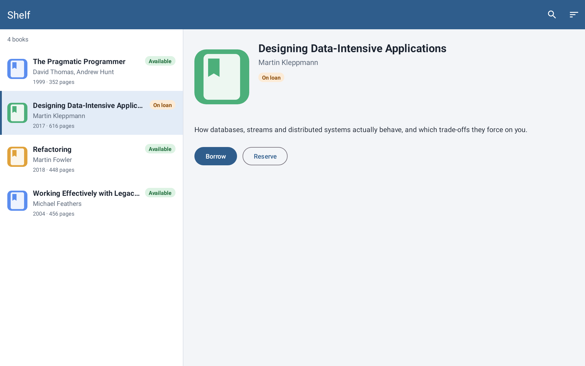
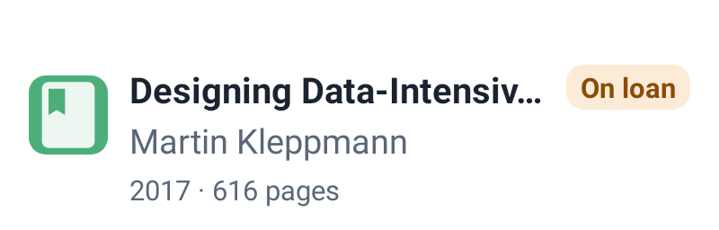

# Demo project

A small, open Android app (XML/View, Material 3) for trying every renderer capability on something
you can clone. It is a real app — `MainActivity`, fragments and an adapter over local sample data —
but the renderer never runs that code: each render request supplies the data explicitly.

```text
sample/
├── app/                 # the Android app (module :app, variant debug)
├── render-requests/     # one MCP call per file: {"tool": ..., "arguments": ...}
├── renders/<scenario>/  # render.png, view-tree.json, request.json, replay.json per request
└── render.py            # runs every request through the MCP server
```

## Screens

| Layout | What it exercises |
| --- | --- |
| `item_book` | a single list row: ConstraintLayout, drawable cover, `maxLines="1"` title, status badge, selected background |
| `fragment_book_list` | a fragment with a `RecyclerView` filled from `recyclerViews` rows |
| `fragment_library` | master-detail in one fragment layout: the list on the left, `<include>`d details on the right |
| `activity_main` | an activity with a `MaterialToolbar` (title and menu come from XML) and a `FragmentContainerView` |
| `view_loading_overlay` | a blocking loading overlay with an indeterminate `ProgressBar` |

## Render it yourself

```bash
./gradlew installDist                  # from the repository root
echo "sdk.dir=$HOME/Android/Sdk" > sample/local.properties
python3 sample/render.py               # or a prefix: python3 sample/render.py 05
```

`render.py` starts the MCP server over stdio with `PROJECT_PATH=sample`, calls each request and copies
the run's `render.png`, `view-tree.json`, `request.json` and `replay.json` into `renders/<scenario>/`
(the absolute project root in `replay.json` is rewritten to `sample`). The same JSON can be passed to the tools from any MCP
client.

## Requests and results

| Request | Tool | Shows |
| --- | --- | --- |
| [`01-item-book`](render-requests/01-item-book.json) | `render_layout` | one row, selected state via `backgroundDrawable` |
| [`02-item-book-long-title-font-1.3`](render-requests/02-item-book-long-title-font-1.3.json) | `render_layout` | `fontScale: 1.3`; the title keeps its bounds but `textLayout.truncated` is `true` |
| [`03-fragment-book-list`](render-requests/03-fragment-book-list.json) | `render_layout` | fragment + RecyclerView rows on a phone-sized canvas |
| [`04-fragment-library-master-detail`](render-requests/04-fragment-library-master-detail.json) | `render_layout` | master-detail with a selected row and fixture values inside `<include>` |
| [`05-activity-toolbar-library`](render-requests/05-activity-toolbar-library.json) | `render_target` | the whole screen: activity toolbar + fragment in `fragmentContainer` |
| [`06-activity-toolbar-library-loading`](render-requests/06-activity-toolbar-library-loading.json) | `render_target` | the same screen with the loading overlay; the spinner is frozen |
| [`07-activity-toolbar-library-ru-night`](render-requests/07-activity-toolbar-library-ru-night.json) | `render_target` | `locale: ru-RU` + `nightMode: true`: strings and colors come from `values-ru` / `values-night` |





For `02`, the View tree reports the truncation that the picture only hints at:

```json
"textLayout": { "textSizePx": 40.0, "maxLines": 1, "lineCount": 1, "ellipsisCount": 81, "truncated": true }
```

## Notes

- The renderer's temporary probe is a JUnit 4 test. The app declares JUnit like the default Android
  Studio template; a project without it works too, because the renderer then adds `junit:junit:4.13.2`
  for the render run only.
- `render_target` composes exactly one fragment layout into one container, so master-detail lives in a
  single fragment layout here.
